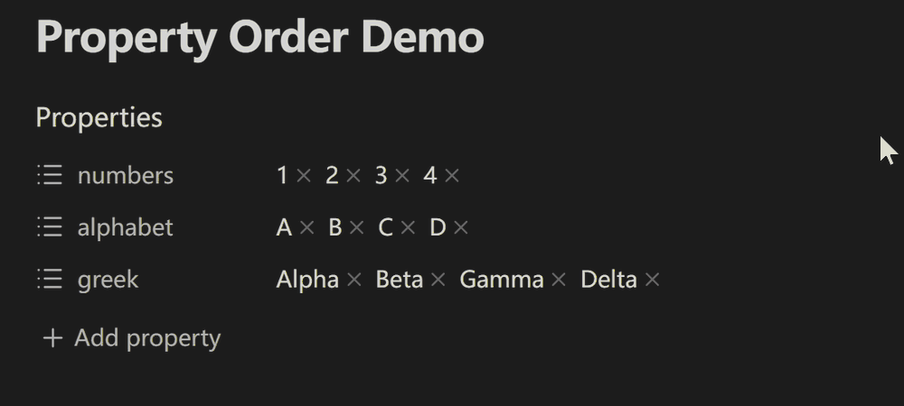
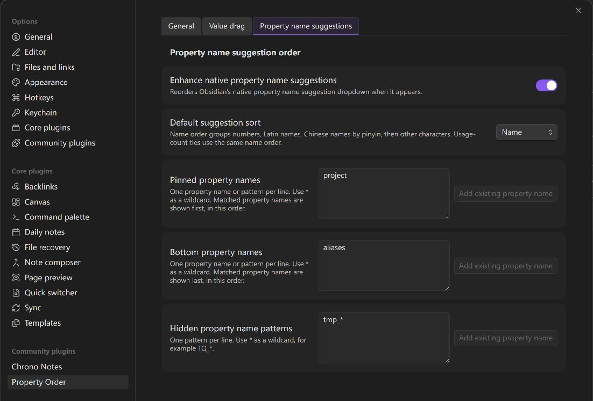

[English](README.md) | [简体中文](docs/i18n/README.zh-CN.md)

# Property Order

Property Order enhances Obsidian Properties by controlling two kinds of order:

- Property value order: on desktop, drag values inside a property or move values between supported properties.
- Property key suggestion order: reorder Obsidian's native key suggestion dropdown with rules.

## Features

- On desktop, drag to reorder values inside a single Properties list.
- Optionally drag values between supported properties in the same note.
- Write same-property reorders and cross-property moves back to YAML frontmatter.
- Preserve each property's current list format by default, or rewrite affected lists as bracket lists or bullet lists.
- Enhance the native property key suggestion dropdown with pinned, bottom, hidden, mixed-language name, and usage-count sorting rules; keyboard navigation follows the resulting visible order.

## Demo

Move a value between compatible list properties on desktop:



Configure native property name suggestion ordering:



## Limitations

- Only supports top-level YAML list properties rendered as Obsidian property pills.
- Does not support object lists, nested lists, multiline flow sequences, source-mode line dragging, or cross-file moves. Unsupported YAML structures fail closed without changing the note.
- Forcing bullet lists into bracket lists may drop list item comments, blank lines, and other block-only formatting.
- Native key suggestion ordering is a soft DOM enhancement. If Obsidian changes the suggestion menu DOM, the plugin should fail open and leave the native menu alone.
- Property-value reordering runs only in the desktop app and requires pointer input; direct keyboard reordering and screen-reader status announcements are not implemented.
- On mobile, Property Order does not intercept property-value gestures, so Obsidian's native long-press menu remains available. Property-name suggestion ordering remains supported.

## Settings

- List writeback format
  - Preserve current format
  - Use bracket lists
  - Use bullet lists
  - Converting bullet lists to bracket lists may drop item comments and blank lines.
- Enable cross-property drag
  - Disabled by default.
- Enhance native key suggestions
  - Reorders the native property key dropdown when it appears.
- Default suggestion sort
  - Name order
  - Usage count
- Pinned keys / Bottom keys / Hidden key patterns
  - One entry per line. Hidden patterns support `*`, such as `TQ_*`.

## Manual installation

Download `property-order-<version>.zip` from the [latest release](https://github.com/ZHYX91/obsidian-property-order/releases/latest) and extract it directly into `Vault/.obsidian/plugins/`. The archive already contains the `property-order/` plugin directory with `main.js`, `manifest.json`, and `styles.css`; reload Obsidian, then enable Property Order under Community plugins. The same three files remain available as separate release assets for Obsidian's automatic installer and updater.

## Development

```bash
npm install
npm run typecheck
npm test
npm run build
npm run check:release
# Or run all four verification steps:
npm run check
```

Build output is written to `dist/property-order/`.

For repeatable real-Obsidian QA in an isolated vault, `npm run acceptance:fixtures -- --vault <vault>` creates exact LF/CRLF/CR notes, and `npm run acceptance:conflict -- --vault <vault> --file <fixture>` injects a timed source edit. Both commands require an Obsidian vault; the conflict injector additionally resolves symlinks, enforces vault containment, and accepts only generated Property Order fixture names. Fixture overwrite requires `--force`. The complete host matrix and evidence boundary live in the testing strategy.

Property Order uses a versioned settings schema and localized frontmatter rewrites. Core parsing, ordering, and pointer interaction stay independent of Obsidian and the browser DOM. Before handing off a change, run `npm run check`; release-facing changes must also close the relevant automated and real-Obsidian acceptance items.

## Documentation

- Product requirements: [English](docs/product-requirements.en.md) / [简体中文](docs/product-requirements.zh-CN.md)
- Architecture: [English](docs/architecture.en.md) / [简体中文](docs/architecture.zh-CN.md)
- UX specification: [English](docs/ux-spec.en.md) / [简体中文](docs/ux-spec.zh-CN.md)
- Testing strategy: [English](docs/testing-strategy.en.md) / [简体中文](docs/testing-strategy.zh-CN.md)

The Chinese documents are authoritative. An exact `x.y.z` tag matching the package version triggers the release workflow, which publishes the three loose Obsidian assets plus the manual-install archive.
