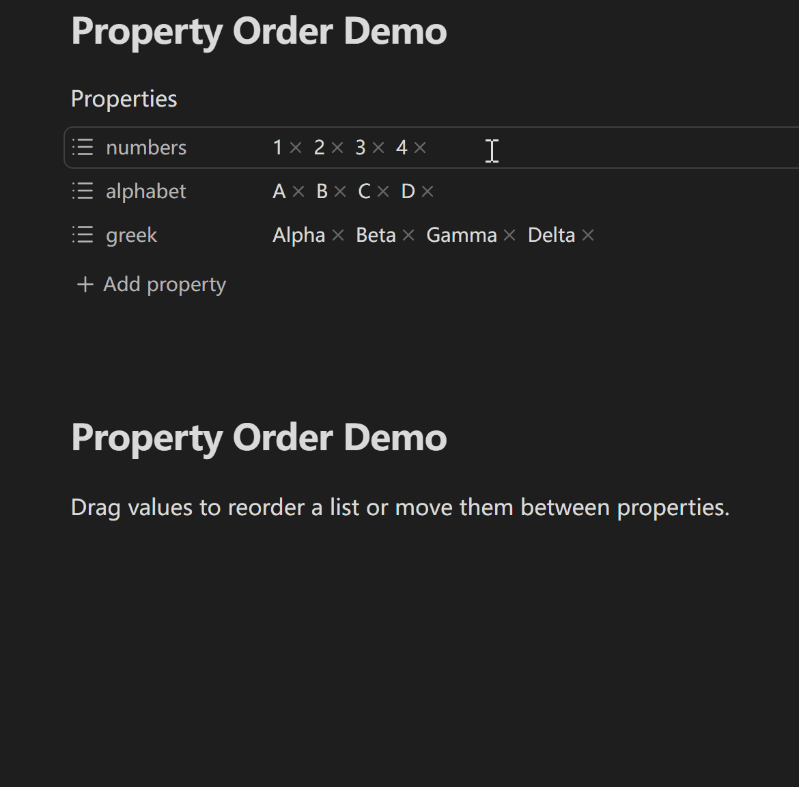

# Property Order

[English](../../README.md) · [简体中文](README.zh-CN.md)

Property Order 用于安全地重排 Obsidian Properties 中的列表值，并按规则调整原生属性名称候选与属性值候选。

## 演示

在桌面端的受支持顶层 YAML 列表属性之间移动值：



跨属性拖拽默认开启，可在“属性值排序”设置中关闭。

## 功能特性

- 重排顶层 YAML 列表属性中的值；
- 在 RTL 和换行布局中按逻辑插入顺序定位，靠近边缘时滚动受支持的 Properties 区域，并通过 polite live status 播报指针拖拽状态；
- 在同一篇笔记的受支持属性之间移动值，并可在设置中关闭；
- 当 Obsidian 原生 Properties UI 将属性定义为列表时，把 YAML 空值或标量作为文本列表处理，允许安全拖入和拖出，并按原 token 文本规范化所有受影响的非字符串元素；
- 默认保留当前列表格式，也可将所有受影响属性写成中括号列表或无序列表；同属性重排与跨属性移动都通过一次经核对的 editor transaction 提交；
- 置顶、置底或隐藏原生属性名称候选；
- 按混合语言名称、严格的最近使用顺序，或包含该属性的 Markdown 笔记数排序属性名称候选；
- 可为每个精确属性键选择一种属性值候选行为：按名称、按已确认选择次数、按 Markdown 笔记数、原生顺序、不显示候选或自定义候选；
- 自定义候选分为置顶、普通和置底三段；用户明确配置的预设值即使当前没有任何笔记使用，也仍可作为候选，普通段仍可按原生、名称、选择次数或笔记数排序；
- 只有 Metadata Cache 确认对应提交成功后才推进属性名称最近记录或属性值选择次数；hover、键盘浏览、取消和未确认编辑都不计入；
- 键盘导航始终遵循最终可见的候选顺序；
- 不支持的 YAML 会安全拒绝写回，无法识别 Obsidian 候选 DOM 时保留原生行为。

## 使用要求与兼容性

- 需要 Obsidian 1.12.7 或更高版本；
- 桌面端支持直接拖动；移动端需要先从 Obsidian 原生长按菜单选择相应操作，再进行拖动；
- 属性值拖拽只处理被 Obsidian 识别为文本列表的顶层 YAML 属性；属性值候选通常重排 Obsidian 已有候选，自定义行为还可通过同一属性编辑器额外提供用户明确配置的预设候选。详细边界见下方“限制”。

## 安装

### 手动安装

从[最新版本](https://github.com/ZHYX91/obsidian-property-order/releases/latest)下载 `property-order-<version>.zip`，解压到 `Vault/.obsidian/plugins/`。压缩包包含 `property-order/` 目录及其中的 `main.js`、`manifest.json` 和 `styles.css`。重新加载 Obsidian 后，在第三方插件中启用 Property Order。

### 升级

如果存在 `Vault/.obsidian/plugins/property-order/data.json`，请先备份并保留。只替换 `main.js`、`manifest.json` 和 `styles.css`；只有在明确希望重置全部插件偏好时才删除 `data.json`。

## 使用

1. 在**设置 → 第三方插件**中启用 Property Order；
2. 打开一篇含顶层 YAML 列表属性的笔记，并显示 Obsidian Properties；
3. 桌面端直接拖动属性值；移动端长按属性值，选择“重排”或“重排或移动”，再拖动该值；
4. 在“属性名候选”中配置新增属性时的名称候选；如有需要，再启用“属性值候选”，用全局默认和按属性规则调整 Obsidian 已有的值候选。

## 设置

所有受支持的 Obsidian 版本统一使用无障碍的“常规、属性值排序、属性名候选、属性值候选”页签。当前页签已经表明所在分区，内容区直接从第一个设置项开始，不再重复同名标题。

- “常规”控制界面语言和可选诊断提示；“跟随 Obsidian”使用 Obsidian 的界面语言；
- “属性值排序”控制列表写回格式、是否允许跨属性移动及相关拖动行为；临时关闭值拖拽时会保留独立的跨属性偏好，重新开启后继续使用；
- “属性名候选”配置原生属性名称候选的置顶、置底、隐藏、按名称、最近使用和笔记数排序。最近使用采用严格 MRU：置顶规则始终在前，已确认名称按从新到旧排列，历史中没有的名称回退到名称排序，置底规则始终在后；笔记数指包含该属性的缓存 Markdown 笔记数量，不是交互次数；
- “属性值候选”默认关闭。未单独配置的属性跟随一个默认行为：原生顺序、按名称、按已确认选择次数、按 Markdown 笔记数或不显示候选。精确 key 可加入六个互斥分组之一：按名称、按选择次数、按笔记数、原生顺序、不显示候选、自定义候选；同一个 key 同时只能有一个生效行为；
- 普通五类使用属性胶囊展示；设置页可统一按属性名称或最近加入排序。添加属性既可手动输入 key，也可从 Vault 已发现和插件已配置的 key 中选择；若 key 已在其他类中，候选仍显示当前归属，确认后一次性移动；
- 自定义候选左侧选择属性，右侧使用置顶、普通、置底三段。置顶和置底支持手动输入预设候选；预设候选即使从未出现在笔记中也会继续提供。普通段可按原生、名称、选择次数或笔记数排序；
- 属性名称最近记录最多保存 100 个精确名称并仅保存在当前设备；属性值选择次数也仅保存在当前 Vault、当前设备，并且只有已确认候选提交才增加。两者都与 `data.json` 分离且不同步。笔记数排序只在需要时惰性扫描缓存 frontmatter，并复用可失效缓存。

## 限制

- 移动端从 Obsidian 原生长按菜单选择“重排”或“重排或移动”后，再拖动同一个值；“编辑 / 从列表中移除 / 复制”仍保留，单次待拖动状态会自动过期；
- 属性值拖拽只支持被 Obsidian 识别为文本列表的顶层 YAML 属性；普通列表使用原生 pill，受守卫的空值或标量不匹配行可作为 source/target，能与当前 YAML 无歧义对齐的混合不匹配行只能接收 append；
- 不支持对象列表、嵌套列表、多行 flow sequence、源码模式行拖拽或跨文件移动；
- 自定义预设候选只作用于 Properties 属性值编辑器。没有原生值候选弹窗时，Property Order 可为已配置的自定义候选显示插件自有的回退弹窗；如果无法安全识别属性编辑器，则 fail open，不改变手动输入；
- 将无序列表转换为中括号列表时，可能丢失中括号语法无法表达的项目注释和空行；
- 当前不提供键盘直接重排属性值；指针拖拽会通过 polite live status 播报拖拽开始与目标变化。

## 隐私与安全

Property Order 通过 Obsidian 的编辑器和 Vault API 读取并更新当前笔记，不要求账号，不上传笔记内容，也不调用远程服务。不支持的 YAML 会在写回前被拒绝；受支持的拖拽修改通过一次经核对的编辑器事务提交。属性名称或属性值候选选择“按 Markdown 笔记数量”排序时，插件会枚举 Markdown 文件并读取缓存的 frontmatter 元数据以计算数量，不会读取每篇笔记的正文。属性名称 MRU 与已确认的属性值选择次数只保存在当前 Vault、当前设备的 Obsidian local storage 中，与 `data.json` 分离且不同步，并可从设置中清除。

## 开发

使用 Node.js 24.19.0 与 npm 11.17.0。按冻结的 lockfile 安装精确依赖图，再执行完整仓库门禁：

```bash
npm ci
npm run check
```

### 文档

- [产品需求](../product-requirements.zh-CN.md)
- [UX 规范](../ux-spec.zh-CN.md)
- [架构](../architecture.zh-CN.md)
- [测试策略](../testing-strategy.zh-CN.md)
- [变更日志](../../CHANGELOG.md)
- [贡献指南](../../CONTRIBUTING.md)
- [安全策略](../../SECURITY.md)

## 支持

- 工作流想法和一般反馈请发布到 [General](https://github.com/ZHYX91/obsidian-property-order/discussions/categories/general)；
- 使用和配置问题请发布到 [Q&A](https://github.com/ZHYX91/obsidian-property-order/discussions/categories/q-a)；
- 可复现缺陷和明确的功能建议请使用结构化的 [GitHub Issue 表单](https://github.com/ZHYX91/obsidian-property-order/issues/new/choose)；
- 安全漏洞请按照仓库的[安全策略](https://github.com/ZHYX91/obsidian-property-order/security/policy)私密报告。

公开发布前请移除 Vault 路径、笔记内容、YAML 属性值和凭据。

## 许可证

[MIT](../../LICENSE) © ZhengYX
