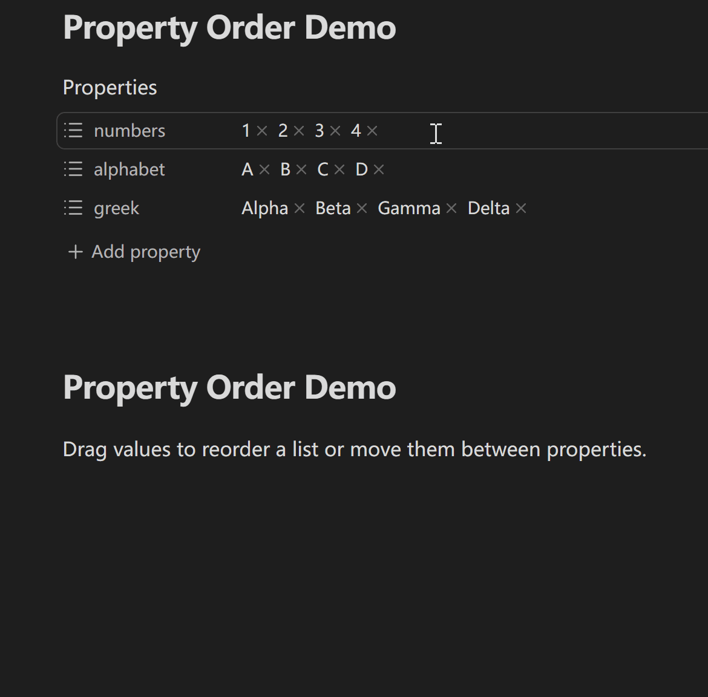

# Property Order

[English](../../README.md) · [简体中文](README.zh-CN.md)

Property Order 用于安全地重排 Obsidian Properties 中的列表值，并按规则调整原生属性名称候选与属性值候选。

## 演示

在桌面端的受支持顶层 YAML 列表属性之间移动值：



跨属性拖拽默认开启，可在“属性值排序”设置中关闭。

## 功能特性

- 在受支持的顶层 YAML 列表属性中拖动并调整值的顺序；
- 在同一篇笔记的受支持列表属性之间移动值。跨属性移动默认开启，也可以单独关闭；
- 如果 Obsidian 把空值或标量显示为列表属性，Property Order 也可以安全地把值拖入或拖出；数字、布尔值等非文本内容会按原来的 YAML 写法转换成文本；
- 默认保留每个属性现有的列表格式，也可以统一写成中括号列表或无序列表。每次成功拖拽只产生一次可撤销的编辑；
- 支持换行和 RTL 布局；拖到边缘时可滚动 Properties 区域，并向屏幕阅读器播报拖拽状态变化；
- 调整原生属性名候选：置顶、置底、隐藏，按名称、最近使用或笔记数排序，并可选择按 Obsidian 属性类型分组普通候选；
- 可按属性管理属性值候选：原生顺序、按名称、按已确认选择次数、按笔记数、不显示候选或自定义候选；
- 自定义候选分为置顶、普通和置底三段。明确配置的预设值即使暂时没有出现在任何笔记中，也可以继续作为候选；
- 只有 Obsidian 确认编辑成功后，才会更新属性名最近记录和属性值选择次数；单纯悬停、浏览、取消或未确认编辑都不会计数；
- 如果插件无法安全理解 YAML 或 Obsidian 的候选界面，就保持笔记或原生界面不变。

## 使用要求与兼容性

- 需要 Obsidian 1.12.7 或更高版本；
- 桌面端支持直接拖动；移动端需要先从 Obsidian 原生长按菜单选择相应操作，再进行拖动；
- 属性值拖拽只处理被 Obsidian 识别为文本列表的顶层 YAML 属性；属性值候选通常重排 Obsidian 已有候选，自定义行为还可通过同一属性编辑器额外提供用户明确配置的预设候选。详细边界见下方“限制”。

## 安装

### 手动安装

从[最新版本](https://github.com/ZHYX91/obsidian-property-order/releases/latest)下载 `property-order-<version>.zip`，解压到 `Vault/.obsidian/plugins/`。压缩包包含 `property-order/` 目录及其中的 `main.js`、`manifest.json` 和 `styles.css`。重新加载 Obsidian 后，在第三方插件中启用 Property Order。

### 升级

如果存在 `Vault/.obsidian/plugins/property-order/data.json`，请先备份并保留。只替换 `main.js`、`manifest.json` 和 `styles.css`；只有在明确希望重置全部插件偏好时才删除 `data.json`。

## 使用

1. 在**设置 → 第三方插件**中启用 Property Order；
2. 打开一篇含顶层 YAML 列表属性的笔记，并显示 Obsidian Properties；
3. 桌面端直接拖动属性值；移动端长按属性值，选择“重排”或“重排或移动”，再拖动该值；
4. 在“属性名候选”中配置新增属性时的名称候选；如有需要，再启用“属性值候选”，用全局默认和按属性规则调整 Obsidian 已有的值候选。

## 设置

所有受支持的 Obsidian 版本都使用相同的四个设置页签：

- **常规**：设置插件语言和可选的诊断提示；
- **属性值排序**：设置列表写回格式、是否允许跨属性移动以及拖拽行为。临时关闭值拖拽不会清除跨属性移动偏好；
- **属性名候选**：设置置顶、置底和隐藏规则，并选择按名称、最近使用或笔记数排序。可选的属性类型分组会把普通候选分成文本、列表、数字、复选框、日期、日期与时间、标签、自动 / 未指定；当前排序方式仍在每个组内生效；
- **属性值候选**：默认关闭。未单独配置的属性使用一个全局默认行为；精确属性名可以分别放入按名称、按选择次数、按笔记数、原生顺序、不显示候选或自定义候选分组；
- 自定义候选使用置顶、普通和置底三段。可以直接输入预设值，因此某个值即使还没有出现在笔记中，也能继续作为候选；
- 属性名最近记录最多保存 100 个名称，属性值选择次数也只保存在当前设备。两者都与 `data.json` 分离、不会同步，并可从设置中清除。

## 限制

- 属性值拖拽只支持 Obsidian 显示为文本列表的顶层 YAML 属性；
- 不支持对象列表、嵌套列表、多行 flow sequence、源码模式行拖拽或跨文件移动；
- 移动端需要先从 Obsidian 原生长按菜单选择“重排”或“重排或移动”，再拖动该值；“编辑 / 从列表中移除 / 复制”等原生操作仍然保留；
- 某些类型不匹配的属性行，只要 Obsidian 能明确识别为列表，仍可以参与拖拽；无法明确对应具体元素的混合值会保守处理，最多只允许追加；
- 自定义预设候选只作用于 Properties 的属性值编辑器。没有原生候选弹窗时，插件可以显示一个自己的回退弹窗；如果无法安全识别编辑器，则保留手动输入，不接管；
- 把无序列表转换为中括号列表时，可能丢失中括号语法无法表达的项目注释和空行；
- 目前不能直接用键盘重排属性值；指针拖拽会向屏幕阅读器播报拖拽开始和目标变化。

## 隐私与安全

Property Order 只在本地工作，不要求账号、不上传笔记内容，也不调用远程服务。

拖拽修改 YAML 时，插件通过 Obsidian 的编辑器 API 提交，并在安排保存前核对结果；无法安全处理的结构不会写入。

使用“按笔记数”排序时，插件会枚举 Markdown 文件并读取缓存的 frontmatter 元数据，不会逐篇读取正文。属性名最近记录和已确认的属性值选择次数只保存在当前设备、当前 Vault 的 Obsidian local storage 中，与 `data.json` 分离，并可从设置中清除。

## 开发

使用 Node.js 24.19.0 与 npm 11.17.0。按冻结的 lockfile 安装精确依赖图，再执行完整仓库门禁：

```bash
npm ci
npm run check
```

### 文档

- [产品需求](../product-requirements.zh-CN.md)
- [UX 规范](../ux-spec.zh-CN.md)
- [架构](../architecture.zh-CN.md)
- [测试策略](../testing-strategy.zh-CN.md)
- [变更日志](../../CHANGELOG.md)
- [贡献指南](../../CONTRIBUTING.md)
- [安全策略](../../SECURITY.md)

## 支持

- [Q&A](https://github.com/ZHYX91/obsidian-property-order/discussions/categories/q-a)：使用和配置问题。
- [Ideas](https://github.com/ZHYX91/obsidian-property-order/discussions/categories/ideas)：尚待讨论的功能与工作流想法。
- [Show and tell](https://github.com/ZHYX91/obsidian-property-order/discussions/categories/show-and-tell)：技巧、工作流和参考实现。
- 可复现缺陷和明确的功能建议请使用结构化的 [GitHub Issue 表单](https://github.com/ZHYX91/obsidian-property-order/issues/new/choose)；
- 安全漏洞请按照仓库的[安全策略](https://github.com/ZHYX91/obsidian-property-order/security/policy)私密报告。

公开发布前请移除 Vault 路径、笔记内容、YAML 属性值和凭据。

## 许可证

[MIT](../../LICENSE) © ZhengYX
